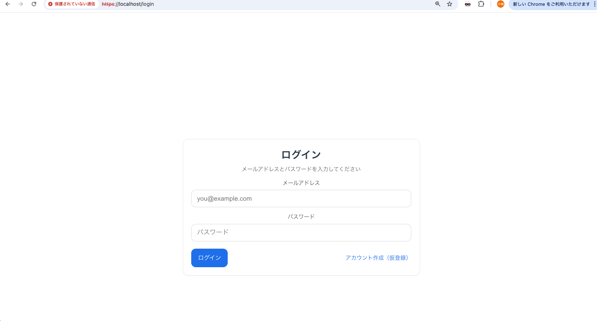
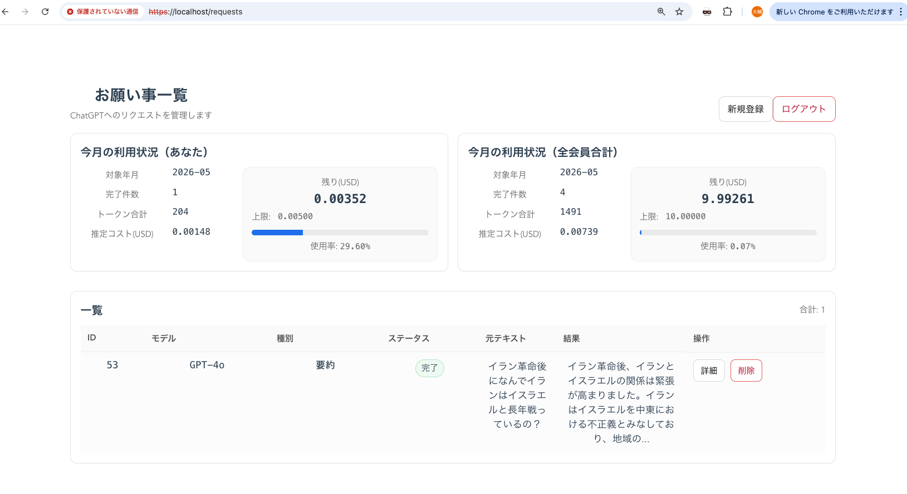

# Fairy System

OpenAI APIの利用額制限付きリクエスト管理システム。

---

## Screenshots

### Login



### Dashboard



---

## 1. 概要

本システムは以下を目的とする。

* Laravel 12 + Vue 3 による SPA 構築の学習
* Python による OpenAI API バッチ処理の実装
* Docker による統合開発環境の構築

---

## 2. システム構成

| 種別    | 技術                   |
| ----- | -------------------- |
| API   | Laravel 12 / PHP 8.2 |
| Front | Vue 3                |
| Batch | Python 3.13          |
| DB    | MySQL 8              |
| Cache | Redis                |
| Web   | Nginx                |
| Mail  | Mailpit              |

---

## 3. OpenAI API 利用コスト計算

```text
利用額($) =
(input_tokens / 1,000,000) × input単価
+
(output_tokens / 1,000,000) × output単価
```

※ output token は生成処理のため高コスト
※ input単価 < output単価

単価設定：

```
laravel/config/chatgpt.php
```

---

## 4. 利用制限

* リクエスト単位の最大トークン数
* 日次トークン制限
* ユーザーごとの月間利用額制限
* システム全体の月間利用額制限

---

### 利用制限設定

```env
CHATGPT_DAILY_MAX_TOKENS=0
CHATGPT_MONTHLY_USER_LIMIT_USD=0.00500
CHATGPT_MONTHLY_GLOBAL_LIMIT_USD=10.00000
```

| 設定値                              | 内容              |
| -------------------------------- | --------------- |
| CHATGPT_DAILY_MAX_TOKENS         | 日次トークン上限（0=無制限） |
| CHATGPT_MONTHLY_USER_LIMIT_USD   | ユーザー月額制限        |
| CHATGPT_MONTHLY_GLOBAL_LIMIT_USD | システム全体制限        |

---

## 🚀 5. セットアップ（初回のみ）

---

### 5.1 .env 作成

```env
OPENAI_API_KEY=your_api_key_here

BATCH_API_KEY=super-secret-batch-key
BATCH_BASE_URL=http://nginx

DB_HOST=mysql
DB_PORT=3306
DB_DATABASE=fairy_db
DB_USERNAME=user
DB_PASSWORD=password

CHATGPT_DAILY_MAX_TOKENS=0
CHATGPT_MONTHLY_USER_LIMIT_USD=0.00500
CHATGPT_MONTHLY_GLOBAL_LIMIT_USD=10.00000
```

※ `.env` はGitに含めない

---

## 🔐 SSL証明書（必須 / Docker起動前に実行）

### Vue3用

```bash
mkdir -p vue3/certs

openssl req -x509 -nodes -days 365 \
  -newkey rsa:2048 \
  -keyout vue3/certs/localhost.key \
  -out vue3/certs/localhost.crt
```

---

### Nginx用

```bash
mkdir -p docker/nginx/ssl

openssl req -x509 -nodes -days 365 \
  -newkey rsa:2048 \
  -keyout docker/nginx/ssl/server.key \
  -out docker/nginx/ssl/server.crt
```

---

### 注意

* Common Name → `localhost`
* 自己署名証明書のためブラウザ警告あり
* 秘密鍵（*.key）はGitに含めない
* `.gitignore` により除外済み

---

### 5.2 Docker 起動

```bash
docker compose up -d --build
```

---

### 5.3 Laravel 初期化

```bash
docker compose exec web_app bash

composer install
cp .env.example .env
php artisan key:generate
php artisan migrate
```

---

### 5.4 Vue 初期化

通常不要（Docker buildで実行済み）

依存変更時のみ：

```bash
docker compose up -d --build
```

---

### 5.5 Python 初期化

不要（Docker build済み）

---

## ▶ 6. 起動方法

```bash
docker compose up -d
```

---

## 🤖 7. バッチ実行

```bash
docker compose exec python_batch bash
python main.py
```

---

## 🌐 8. アクセス

| 種別   | URL                      |
| ---- | ------------------------ |
| Web  | https://fairy_system.com |
| Mail | http://localhost:8025    |

---

## 🛠 9. よく使うコマンド

### 停止

```bash
docker compose down
```

### 再ビルド

```bash
docker compose up -d --build
```

### ログ

```bash
docker compose logs -f
```

---

## ⚠ 10. 注意点

### Laravel

```
config/chatgpt.php
```

で利用制限管理

---

### Python

Laravel APIから設定取得

```
GET /api/batch/chatgpt/config
```

---

## 💡 Tips

* OpenAIは「outputコストが高い」
* 制限ロジックは必須
* バッチは「止まる設計」が重要
